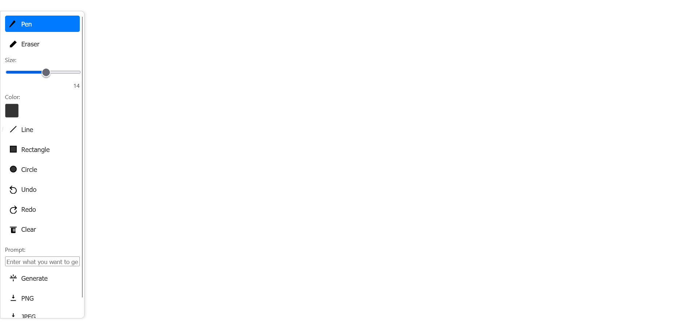

# DrawReal - Realistic Image Generator

DrawReal is an innovative, AI-powered web application that allows users to instantly transform their drawings into realistic or stylized images. With its user-friendly interface, drawing has never been this fun and transformative!
## 📸 Application Screenshot



## ✨ Features

This application offers a rich set of features for artists and enthusiasts to interact with digital drawing and AI integration:

* **Real-time Transformation:** Instantly convert your drawings into realistic images with the power of artificial intelligence.
* **Web-Based Interface:** Access directly from your web browser, no installation required.
* **Comprehensive Drawing Tools Set:**
    * **Pen Tool:** For freehand, fluid lines and sketching.
    * **Eraser Tool:** To easily clear unwanted parts on the canvas.
    * **Line Tool:** To create precise and straight lines.
    * **Rectangle Tool:** To draw neat rectangular and square shapes.
    * **Circle/Ellipse Tool:** To draw perfect circles and ellipses.
* **Adjustable Drawing Parameters:** Easily adjust the size and color of your drawing tool (pen, line, etc.) to fine-tune your creations.
* **Undo/Redo Functionality:** Full drawing history management, allowing you to correct mistakes quickly or reapply undone actions.
* **Clear Canvas:** Instantly clear all canvas content with a single click and start fresh.
* **AI-Powered Image Generation (Text-to-Image / Image-to-Image):**
    * Generate entirely new, AI-created images by combining your drawing (interpreted as an edge map or sketch) and the text prompt you provide.
    * A clear loading indicator is displayed during the image generation process, keeping you informed of the operation's status.
* **Modern Pop-up Image Display:** Generated images are shown in a stylish and user-friendly pop-up window in the center of the screen, without interrupting your main workspace.
* **Multiple Image Download Options:** Easily download both your original canvas drawing and the final AI-generated images in high-quality PNG or JPEG formats.
* **Responsive Design:** The application is designed to adapt seamlessly to different screen sizes and devices (mobile, tablet, desktop), ensuring a consistent user experience across all platforms.
* **Smart Sliding Toolbar:** The toolbar, elegantly positioned on the left edge of the screen, slides fully into view on mouse hover and gracefully retracts when the mouse leaves, maximizing the canvas workspace.

## 🚀 Setup and Running

Follow these steps to set up and run DrawReal on your local machine:

### Prerequisites

Before you begin, ensure you have the following installed on your system:

* Python 3.8+
* `pip` (Python package manager)
* CUDA-enabled GPU (recommended for faster processing)

### Steps

1.  **Clone the Repository:**
    ```bash
    git clone [https://github.com/YOUR_USERNAME/DrawReal-AI-Image-Generator.git](https://github.com/YOUR_USERNAME/DrawReal-AI-Image-Generator.git)
    cd DrawReal-AI-Image-Generator
    ```

2.  **Create a Virtual Environment (Recommended):**
    ```bash
    python -m venv venv
    source venv/bin/activate  # Linux/macOS
    # or
    venv\Scripts\activate     # Windows
    ```

3.  **Install Required Libraries:**
    ```bash
    pip install -r requirements.txt
    ```

    * **Important Note:** The `requirements.txt` file lists large AI libraries like `torch` and `torchvision`. If you have a CUDA-enabled GPU in your system, make sure the CUDA-supported versions of these libraries are installed correctly (usually done with commands like `pip install torch torchvision torchaudio --index-url https://download.pytorch.org/whl/cu118`). If you don't have a GPU or prefer to run the model on CPU only, you might need to change the `torch` and `torchvision` lines in `requirements.txt` to versions including the `+cpu` suffix (e.g., `torch==2.7.1+cpu`). Additionally, other necessary libraries like `opencv-python` are also specified in `requirements.txt` and will be installed automatically.

4.  **Download Model Weights:**
    The project requires specific weight files to run the underlying AI model. These weights can be downloaded automatically via the `download_url` function in `pix2pix_turbo.py`. This download process will start on the first run.

5.  **Run the Application:**
    ```bash
    python app.py
    ```

    Once the application is running, open your browser and navigate to `http://127.0.0.1:5000/` to access DrawReal.

## 🎨 Usage

1.  After starting the application, you will see the DrawReal interface open in your browser.
2.  Use the sliding toolbar on the left edge of the screen to select drawing tools (Pen, Eraser, Line, Rectangle, Circle) and adjust brush size and color.
3.  Start drawing on the canvas. As you draw, you will see the AI model attempting to transform the image in real-time.
4.  You can manage your drawing with the `Undo`, `Redo`, or `Clear` buttons.
5.  In the `Prompt` field, write a description of what you want your drawing to look like (e.g., "a forest house", "sunset on the beach"). This prompt helps the AI model better guide its output.
6.  When you click the `Generate` button, your drawing and prompt will be sent to the AI model, and the result will be displayed in a new pop-up window.
7.  To save the generated image, use the `Save PNG` or `Save JPEG` buttons within the pop-up window.
8.  You can also save your drawing from the main canvas using the `PNG` or `JPEG` buttons located at the bottom of the toolbar.

## ⚙️ Technical Details

### AI Model

The underlying AI model of this project is the Pix2Pix-Turbo model, developed by **[GaParmar](https://github.com/GaParmar)** and used in their `img2img-turbo` project, which has fast image-to-image conversion capabilities. The core code structure and weights of the model are adapted from this project.

**Reference:**
[https://github.com/GaParmar/img2img-turbo/tree/main](https://github.com/GaParmar/img2img-turbo/tree/main)

The model extracts edge maps from your input drawings using Canny Edge Detection and then synthesizes realistic images based on these edge maps.

### Project Structure

* `app.py`: Contains the Flask server and main application logic. It handles incoming requests, calls the AI model, and returns images.
* `index.html`: Defines the user interface (HTML). The drawing canvas, toolbars, pop-up modal, and save buttons are located here.
* `script.js`: This is the main JavaScript code that handles drawing canvas interactions, tool logic, undo/redo functionality, API communication, and pop-up management.
* `style.css`: Contains the CSS styles that define the application's visual design, layout, and responsive behavior.
* `pix2pix_turbo.py`: Contains the logic for loading, configuring, and performing inference with the Pix2Pix-Turbo model. It is adapted from the original `img2img-turbo` project.
* `model.py`: Houses some low-level configurations and helper functions for the AI model (e.g., single-step scheduler, VAE encoder/decoder modifications).
* `requirements.txt`: Lists all Python dependencies of the project.
* `assets/`: Contains media assets like the demo GIF (referenced).
* `static/`: Contains static assets like CSS and JS files.

## 🤝 Contributing

Feel free to contribute to the project! All suggestions for improvements, bug fixes, or new feature additions are welcome. Please open an Issue before submitting a Pull Request to state your intentions.

## 📧 Contact

For any questions or feedback, you can contact me:

Burak Eskibağ - burakeskibag1@gmail.com
